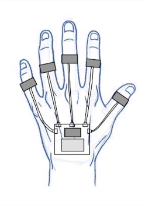
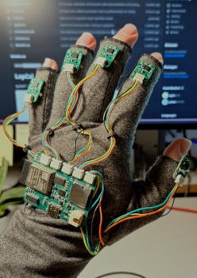
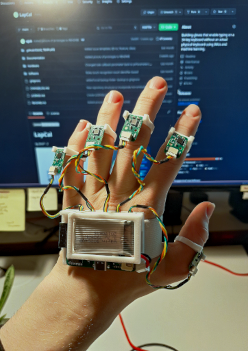

[![CC BY-NC-SA 4.0][cc-by-nc-sa-shield]][cc-by-nc-sa]

# LapCal

*by Emil² - Ξ*

Building gloves that enable typing on a 34-key keyboard without an actual physical keyboard using IMUs and machine learning. 

This work is licensed under a
[Creative Commons Attribution-NonCommercial-ShareAlike 4.0 International License][cc-by-nc-sa].

[![CC BY-NC-SA 4.0][cc-by-nc-sa-image]][cc-by-nc-sa]

[cc-by-nc-sa]: http://creativecommons.org/licenses/by-nc-sa/4.0/
[cc-by-nc-sa-image]: https://licensebuttons.net/l/by-nc-sa/4.0/88x31.png
[cc-by-nc-sa-shield]: https://img.shields.io/badge/License-CC%20BY--NC--SA%204.0-lightgrey.svg

## Attributions

- For the ring models we use the [Round Anything library by Irev-Dev](https://github.com/Irev-Dev/Round-Anything), licensed under the MIT License.
